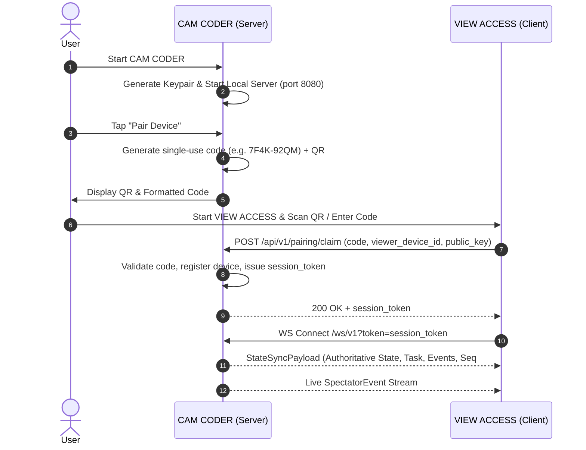

# Smart Spectator — Local-First Embedded Architecture

Smart Spectator turns a spare smartphone into an intelligent camera/observer and local server.

---

## 1. System Overview: CAM CODER as Authoritative Server

```
                     ┌─────────────────────┐
                     │   OPTIONAL CLOUD    │
                     │                     │
                     │ WebRTC Signaling    │
                     │ STUN / TURN Relay   │
                     │ Push Notifications  │
                     │ Optional Remote AI  │
                     └─────────┬───────────┘
                               │
                        signaling only
                               │
                               ▼
┌───────────────────────────────────────────────────────┐
│                    CAM CODER                          │
│                                                       │
│ Flutter Application                                   │
│   │                                                   │
│ Camera Sensor (Hardware)                              │
│   │                                                   │
│ Local CV & Motion Detector (Luminance Variance)       │
│   │                                                   │
│ Local Monitoring & Rule Engine                        │
│   │                                                   │
│ Local Database (SQLite via sqflite)                   │
│   │                                                   │
│ Embedded Local API Server (dart:io HTTP 0.0.0.0:8080) │
│   │                                                   │
│ Embedded WebSocket Broadcast Hub (/ws/v1)             │
│   │                                                   │
│ P2P / WebRTC & Local Wi-Fi Discovery (mDNS/UDP)       │
└─────────────────────────┬─────────────────────────────┘
                          │
         1. Local LAN (Direct HTTP / WS)
         2. Remote Direct P2P (WebRTC via STUN)
         3. Remote Relay Fallback (TURN)
                          │
                          ▼
┌───────────────────────────────────────────────────────┐
│                    VIEW ACCESS                        │
│                                                       │
│ Flutter Android / iOS                                 │
│ Desktop Web / Mobile Web                              │
│                                                       │
│ Viewer UI & Diagnostics                               │
│ Connection Manager (Priority: Local -> P2P -> Relay)  │
│ Local Event Sequence Cache & State Reconciliation     │
└───────────────────────────────────────────────────────┘
```

---

## 2. Core Architectural Principles

1. **CAM CODER is the Server & Data Owner**:
   - Owns the physical camera, monitoring session, observations, AI results, alerts, and local history.
   - Operates fully offline on the local network even if the internet is down.
   - The cloud **never** holds authoritative monitoring state or video footage.
2. **VIEW ACCESS is a Client**:
   - Queries CAM CODER for authoritative assessments.
   - Receives monotonic event sequence numbers (`sequence_number`).
   - Automatically detects missed events upon reconnection and requests gap synchronization.
3. **No Continuous Video Streaming by Default**:
   - Defaults to transmission of low-bandwidth state updates only (e.g. `WATER_LEVEL: 85%`).
   - Saves evidence frames locally on CAM CODER and delivers them securely upon viewer request.
4. **Three-Tier Connection Priority**:
   - **Tier 1 (Direct Local Wi-Fi)**: Zero-config mDNS / UDP broadcast discovery (`_smart-spectator._tcp`) ➔ Direct HTTP/WS connection (`🟢 CONNECTED · LOCAL`).
   - **Tier 2 (Direct P2P)**: WebRTC data channel negotiated via cloud signaling + STUN (`🟢 CONNECTED · P2P`).
   - **Tier 3 (Relay Fallback)**: End-to-end encrypted TURN relay when symmetric NAT blocks direct P2P (`🟡 CONNECTED · RELAY`).

---

## 3. Cryptographic Identity & Pairing Handshake



---

## 4. Local REST & WebSocket API Specification

The embedded Dart server on CAM CODER exposes:

| Endpoint | Method | Description |
|---|---|---|
| `/api/v1/health` | GET | Unauthenticated health status and device role |
| `/api/v1/device` | GET | Device public key and capabilities |
| `/api/v1/status` | GET | Real-time camera telemetry, active task, and viewer count |
| `/api/v1/tasks` | GET/POST | Query and create monitoring tasks |
| `/api/v1/tasks/{id}/start` | POST | Start monitoring task |
| `/api/v1/tasks/{id}/stop` | POST | Stop monitoring task |
| `/api/v1/events` | GET | Query events (supports `?after={sequence_number}` for gap reconciliation) |
| `/api/v1/alerts` | GET | Query alerts (supports `?unread_only=true`) |
| `/api/v1/alerts/{id}/read` | POST | Mark alert read |
| `/api/v1/pairing/claim` | POST | Claim pairing code and receive authorized session token |
| `/ws/v1` | WS | Real-time event stream and initial state synchronization |
